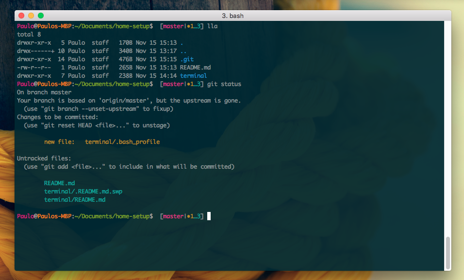

# Terminal

Here are listed some files that I use to improve my user experience with a terminal. All of the files contained in this folder should be placed in your home folder.

## Getting Started

Well, the first thing to do is to forget about the OSX default terminal app, and install a new one.

In Linux systems, normally I use [Terminator](http://gnometerminator.blogspot.pt/p/introduction.html).
**Terminator** is avaibale for Mac OS X, but at the time of this writing, you had to install it using the [Fink project](http://www.finkproject.org).
I've nothing against the **Fink project**, I just wanted a faster solution. Googled *"best osx terminal"* and decided to try [iTerm2](https://www.iterm2.com).

## Installation

Before installing, pay attention to the following requirements:
- I'm using [vim](http://www.vim.org) as the default editor when using git on the command line, so you **must have vim installed**. If you want to use another editor you'll have to change the *[core] section* of the .gitignoe file.  

Now, to install the setup:

1. Copy the files in this repository folder to your home folder. **Atention!** Do not replace your *.bash_profile* file with mine's. Just copy it's content. 
2. Install **iTerm2** and apply the [Solarized](https://github.com/altercation/solarized) theme. To apply the theme, you can define a new profile in **iTerm2** preferences and load the colors provided by Solarized for iTerm2. 
3. Go to [magicmonty's bash-git-prompt](https://github.com/magicmonty/bash-git-prompt) repository and follow his [instructions](https://github.com/magicmonty/bash-git-prompt#via-git-clone) to setup git information in your bash prompt. Basically, you just have to clone his repository and put the contents in a folder named *.bash-git-prompt* in your home folder. 

In the end, your **iTerm2** app should look something like this:

**Note**
Usually your home folder will easily grow since it's a common practice to place there hidden files that configure a given plugin.
To keep things a bit more organized, the file *.bash_profile* loads the following resources from the *.bash_tweaks* folder:
- aliases: use this file to specify any command alias you found suitable.
- bash_prompt: use this file to theme and style the bash prompt.  
- exports: use this to define any variable that needs to be exported as an envinronment variable.
- extra: use this file, well, for anything that doesn't fit in the others!
- functions: use this file to define general functions.

## Credits

Some of the ideas or plugins mentioned are not mine, so you might be interested in knowing their sources:
- [bash-git-prompt](https://github.com/magicmonty/bash-git-prompt)
- [mac-dev-setup](https://github.com/nicolashery/mac-dev-setup#projects-folder), where I grabbed the idea to split in separate files some common bash tasks, and some tweaks to the prompt.
- [Solarized Theme](https://github.com/altercation/solarized)
 
